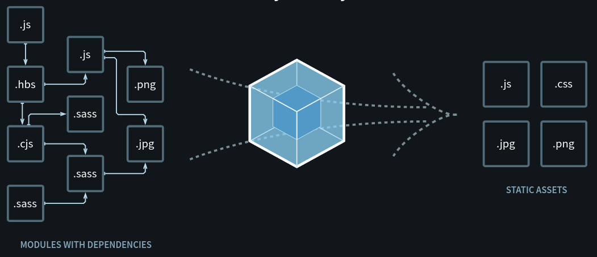

# Resumen - 1er Sesión

- Prerrequisitos
  - Tener instalado Node.js
    - <https://nodejs.org/es/>
  - Tener instalado Webpack 5
    - <https://webpack.js.org/guides/installation/>
    - <code>npm install --save-dev webpack</code>
  - Tener instalado Webpack CLI
    - <code>npm install --save-dev webpack-cli</code>
- 
  - Descripción general:
    - Webpack es una herramienta Open Source utilizada por los desarrolladores para empaquetar y exportar todos los ficheros necesarios para que un proyecto funcione con todas sus dependencias, además de buscar la optimización de estos.
  - Conceptos clave:
    - Entry
    - Output
    - Loaders
    - Plugins
    - Mode
    - Browser Compatibility
- Tarea: [TAREA.md](TAREA.md)